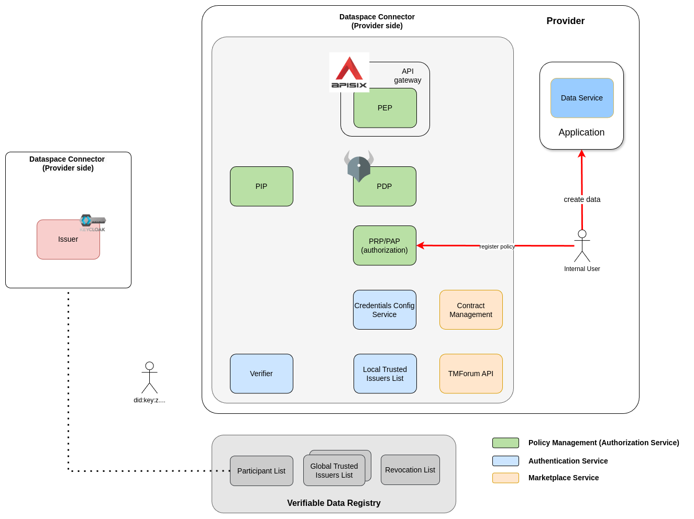
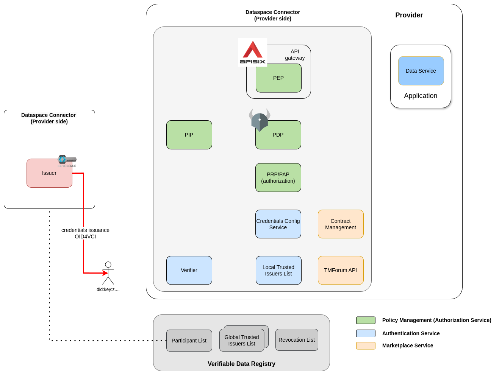
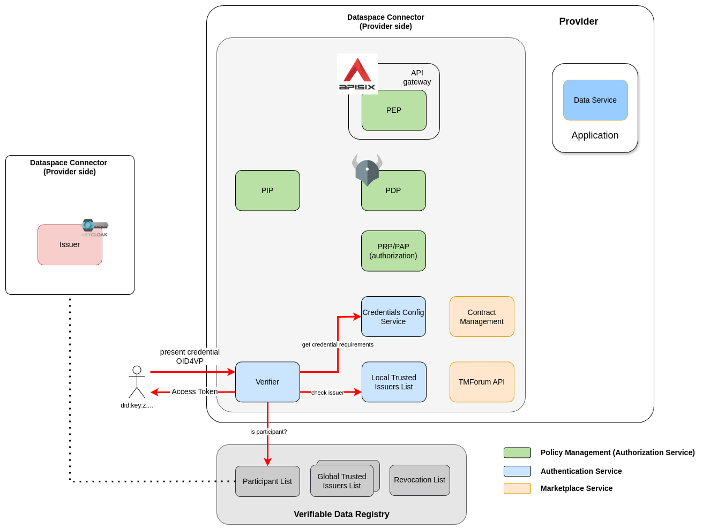
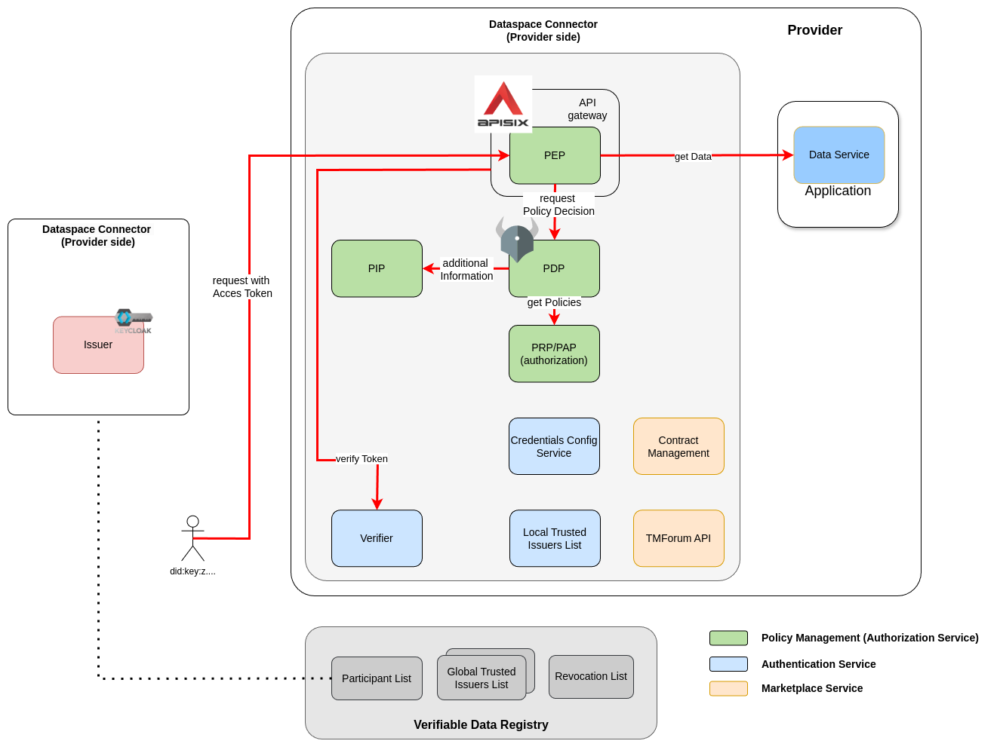
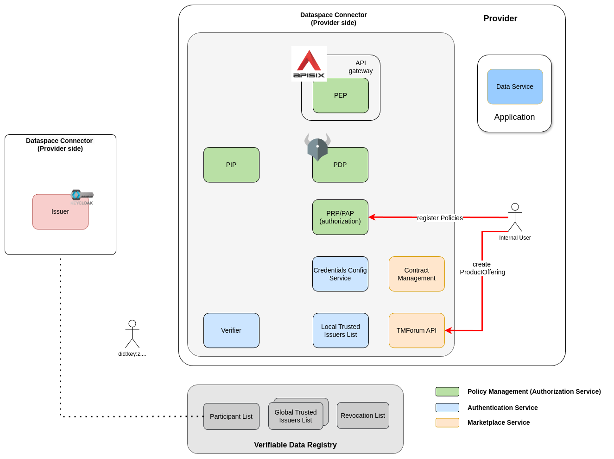
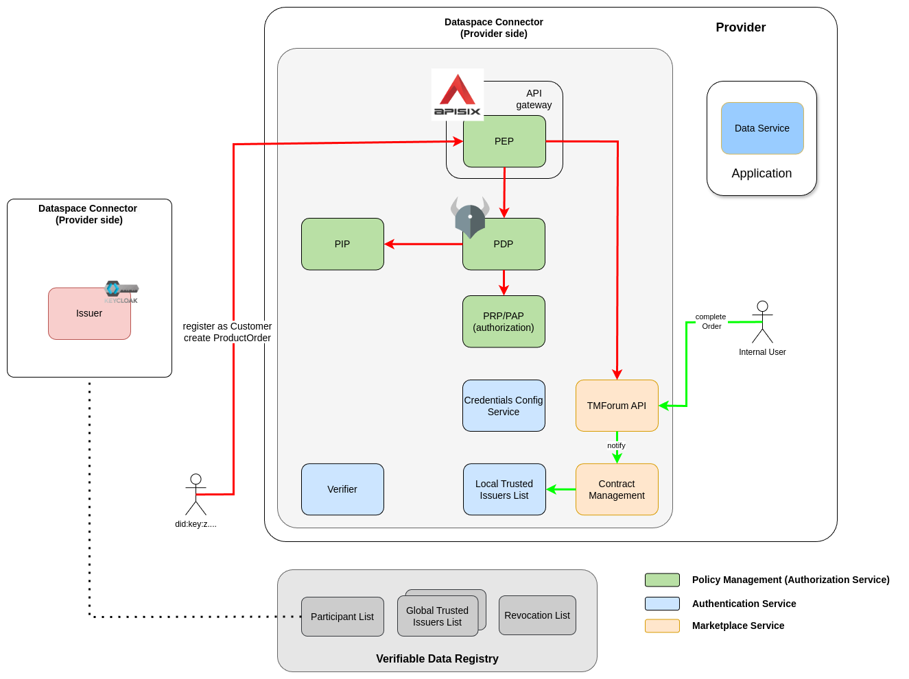

# Building a decentralized Data Space with the FIWARE Data Space Connector

Aufbau eines dezentralen Datenraums mit dem FIWARE Data Space Connectoar

## Preparation

>:warning: For everything to properly work, a couple of components need to be setup properly. The script ```./scripts/check_tools.sh``` can be used to see if everything is available.

### Run the base cluster

The FIWARE Data Space Connector uses a microservice archictecture that is best suited to run in a Kuberentes cluster. To have local environment as a test setting, a k3s cluster with basic infrastructure can be created via:

```shell
    mvn clean deploy -f base-cluster/pom.xml
    export KUBECONFIG=$(pwd)/base-cluster/target/k3s.yaml
```

With `kubectl get pods --all-namespaces` you can get a list of all pods running.

### Consumer Identity

In order to authenticate with a [did:elsi](https://alastria.github.io/did-method-elsi/) inside the Data Space, proper key-material has to be prepared. For usage in the Demo-Data Space a certificate following the [ESI-Profile](https://www.etsi.org/deliver/etsi_en/319400_319499/31941203/01.02.01_60/en_31941203v010201p.pdf) is generated and published through the components:

* [Digital-Signature-Service](https://github.com/wistefan/dss-validation-service): Verifies signatures according to the eIDAS requirements. Checks against european trusted lists and locally registered certificates
* [Keycloak](https://github.com/keycloak/keycloak): In order to sign credentials, Keycloak requires the key-material

The concrete identity can be configured in the [config](./config/config). 

To create the certificates and keys and add them to the config files, use:
```shell
    cd config/
    # insert the identity you want to use, f.e. ./create-identity.sh VAT-BE1234567
    ./create-identity.sh <ID-TO-BE-USED>
```

### Deploy the trust anchor

In addition to checking the public trusted service providers, a Data Space usually will run some Trust Anchor Service to provide lists of participants. In order to deploy the trust anchor, use:

```shell
    helm install trust-anchor data-space-connector/trust-anchor --version 0.2.0 -f ./trust-anchor/trust-anchor.yaml --namespace=trust-anchor
    watch kubectl get pods -n trust-anchor
```

### Deploy the provider

In order to keep things easy, we will not specifically create a did-elsi for the provider, but just deploy its offering capabilities:

```shell
    helm install provider-dsc data-space-connector/data-space-connector --version 7.29.0 -f config/provider-elsi.yaml --namespace=provider
    watch kubectl get pods -n trust-anchor
```

### Deploy the consumer

Since the key-material was already prepared, the consumer can be deployed via:

```shell
    helm install consumer-dsc data-space-connector/data-space-connector --version 7.29.0 -f config/consumer-elsi.yaml --namespace=consumer
    watch kubectl get pods -n consumer
```

Register the consumer at the Data Space:

```shell
  ./scripts/register_at_tir.sh $(yq ".elsi.did" config/consumer-elsi.yaml) 
```

### Create some data
 
To have some data available, a demo entity needs to be created and the policy allowing access to it needs to be registered.

```shell
    ./scripts/prepare_demo_data.sh
```



## Interaction

In order to interact with the data-service, we will create a User Identity and get a VerifiableCredential for that User.

Generate an end-user identity to use the credential in a VerifiablePresentation:

```shell
    mkdir -m 777 holder
    docker run -v $(pwd)/holder:/cert quay.io/wi_stefan/did-helper:0.1.1 
    export HOLDER_DID=$(cat holder/did.json | jq '.id' -r); echo ${HOLDER_DID}
```

Get the Verifiabel Credential is required:

```shell
    export USER_CREDENTIAL=$(./scripts/get_credential_for_consumer.sh http://keycloak-consumer.127.0.0.1.nip.io:8080 user-credential); echo ${USER_CREDENTIAL}
```



The decoded-credential:
```json
{
  "alg": "RS256",
  "cty": "json",
  "kid": "MIGAMGikZjBkMQswCQYDVQQGEwJERTEPMA0GA1UECAwGQmVybGluMRIwEAYDVQQKDAlGSVdBUkUgQ0ExEjAQBgNVBAMMCUZJV0FSRS1DQTEcMBoGCSqGSIb3DQEJARYNY2FAZml3YXJlLm9yZwIUXa39yvDQ3WdDrsGHuovkkIiQJEA=",
  "x5t#S256": "hnQAipKfFiOiaMsYey1O4KOwwBi7c9iF2qHHrlVR2FY",
  "x5c": [
    "MIIHVjCCBT6gAwIBAgIUXa39yvDQ3WdDrsGHuovkkIiQJEAwDQYJKoZIhvcNAQELBQAwZDELMAkGA1UEBhMCREUxDzANBgNVBAgMBkJlcmxpbjESMBAGA1UECgwJRklXQVJFIENBMRIwEAYDVQQDDAlGSVdBUkUtQ0ExHDAaBgkqhkiG9w0BCQEWDWNhQGZpd2FyZS5vcmcwHhcNMjUwMjE3MTQyNzIyWhcNMzAwMjE2MTQyNzIyWjCByjELMAkGA1UEBhMCQkUxETAPBgNVBAgMCEJSVVNTRUxTMREwDwYDVQQHDAhCcnVzc2VsczEeMBwGA1UECgwVRmFuY3kgTWFya2V0cGxhY2UgQ28uMSIwIAYDVQQDDBl3d3cuZmFuY3ktbWFya2V0cGxhY2UuYml6MSwwKgYJKoZIhvcNAQkBFh1jb250YWN0QGZhbmN5LW1hcmtldHBsYWNlLmJpejELMAkGA1UEBRMCMDMxFjAUBgNVBGEMDVZBVEJFLTEyMzQ1NjcwggIiMA0GCSqGSIb3DQEBAQUAA4ICDwAwggIKAoICAQChWIRJHbTqxTt97K6uiXshcIE3SoVaFgLDiL/dBD6NZMqDQf+JYzSi+i9yMZDBnVPvz1Ubvp7H3jr5QjVNuDAKOsk6r+nFImQ0RmobZhRI6WEbjH18roD6dx0lXgGFvSKC3CdMy6f8pyFvVD9Bi5uzP06DG2ajxBsaSQMfi/R/NJMRpbiQmQlTZ0lnLgDP8MSv0yTTLzCyZsqB4KwI7TbfanU3lSj3V6OD+X4ucXw9F0AR4xtPx9lkoctq6KSzRpOz7Kz4O3BYu/SKIrG5S/SkTSR0xKizbL8AXQzS9l/1QFa6Je/GUwecJ6p9kb+nFR5MKtKa5+SyDwwH1d2I9kWuOGGasejppCf3F5BTPvKS1RNppf7XMfNSMHJ08YPAxyzhjrAzhBZZ0+ZPwo+xg7nfzvheLndqYZ9zSJXyueMNCV0es/E7IBYdzsZCJZbRD1kbnjx1ijtFBYtg9LBieIZjBv7+gJWTZi33H5kT9/No5oMaKoGdhqfz7OI00cJCFnF23tyXCxQZqdWn0qPq7XurUNMlc+A7LBfdCYcJKYXe5Ky5VLXMfpiTOaZn2/1/0OjrZROFsFPuSkmKX7qNZHmozcAZiyx6Pbi+2x7puKruN8oGLgSo11gUFB0iHneCwQiiuZDRcN6GUSrs6Z9PbE4z0oE/kzr2yTzjEw3mgMBQBQIDAQABo4IBlzCCAZMwgZ4GCCsGAQUFBwEDBIGRMIGOMAgGBgQAjkYBATA4BgYEAI5GAQUwLjAsFiFodHRwczovL2V4YW1wbGUub3JnL3BraWRpc2Nsb3N1cmUTB2V4YW1wbGUwIQYGBACBmCcCMBcMDFNvbWUgdGVzdCBDQQwHWFgtREZTQTAlBgYEAI5GAQYwGwYHBACORgEGAQYHBACORgEGAgYHBACORgEGAzAJBgNVHRMEAjAAMBEGCWCGSAGG+EIBAQQEAwIFoDAzBglghkgBhvhCAQ0EJhYkT3BlblNTTCBHZW5lcmF0ZWQgQ2xpZW50IENlcnRpZmljYXRlMB0GA1UdDgQWBBT1QuSdwsu/UuG4TixiupZR/5dVwjAfBgNVHSMEGDAWgBS+7M8z6R2KpTchLp2KVfMcp5KbszAOBgNVHQ8BAf8EBAMCBeAwHQYDVR0lBBYwFAYIKwYBBQUHAwIGCCsGAQUFBwMEMC4GA1UdHwQnMCUwI6AhoB+GHWh0dHA6Ly9sb2NhbGhvc3Q6MzAwMC9jcmwucGVtMA0GCSqGSIb3DQEBCwUAA4ICAQBtFmiUCmIl5SY4FKXwXq3dW3CmwNBhOLJL6ZkD0VZJIlC20CS/EYUx7elPQh4vkZFQfy75UBPZlti7CVWHOiAHzk+XuQeW0/3zxhReH6nHJzdX8eW1skAU+K+9eUoQ8nyV9M7Q+vYpwhvfCjpNvZNUetUYB3sTUwpcdG65jHk8M/MfYAyqRadt0bWodnY1PHm3zsZRN4TLdgte1RRnvwnoTeK/ot36xff9z8uCBzLSXWxD9pYKLINCNS7dJ/82BbZghiJY2e2S1S5rPrH/B08USEFPJLDPW+qjWNxfi8IA5ofLaxQ9CVgaYOyrXrnahniDsFwneu5cvH5BEk8O1ELNyLXM0IvI3FrNEWIFeO5zBr6J+NF11kh8uFDvZxL+m8fbm+pt6EECNrgxSm0RZeKjrWhEggIu3Kgy/x0JcSG+azTrkkpCLMSr5E5cSerQuRJQLMitTw5t2lAW3B3KderW1/RnsJhJi67MPs0y1R5JPvbSLjtPUwOaSVVPN9nn5iXStEtBqYRP40FGL09Pdx7PIzWXJEP/oq90mSSLTa8aQGdaXDZLjDA03/dpOf9tqTdSULC9UHcmV4QpOumGRNylmrvmfICsEoxqufL/9yNNIk9VAUsDWEKaf60Y5IbAZCP1tVwOPs6YamrMpUfjt5Yor9U23EN3SktJinIWLSuMhg==",
    "MIIFyDCCA7CgAwIBAgIBATANBgkqhkiG9w0BAQsFADCBgjELMAkGA1UEBhMCREUxDzANBgNVBAgMBkJlcmxpbjEPMA0GA1UEBwwGQmVybGluMRIwEAYDVQQKDAlGSVdBUkUgQ0ExEjAQBgNVBAMMCUZJV0FSRS1DQTEcMBoGCSqGSIb3DQEJARYNY2FAZml3YXJlLm9yZzELMAkGA1UEBRMCMDEwHhcNMjUwMjE3MTQyNzIxWhcNMzIwNTIxMTQyNzIxWjBkMQswCQYDVQQGEwJERTEPMA0GA1UECAwGQmVybGluMRIwEAYDVQQKDAlGSVdBUkUgQ0ExEjAQBgNVBAMMCUZJV0FSRS1DQTEcMBoGCSqGSIb3DQEJARYNY2FAZml3YXJlLm9yZzCCAiIwDQYJKoZIhvcNAQEBBQADggIPADCCAgoCggIBAJykE+eTvR3EYKXsUaiY+z+4OVIf3VpdHtVU+esGCWng/kYN3j9MIxOhr0lbN9PBcztn+DpiX44/bosNKGjsBfM9horvlG5UEruon8djjf2XEYPjtWDYRjaPyfoznhE7wxSRQt6yzeAmxDCVTEpxWxX/nkImH3R34B/0Vvqa6dIpv+X0XU/ua8Jx7l74l524+qX/e4cKd5doZzskulhs3zc9nnXH8zR7bT89mz1Vsnd9fiMTpC4BOFFsaTG1qTuAbSuBtEUICWoeugefG8OL77XiWIvCkDAKE1g4i7GBskCrtMdqcm/vcLQiyEB/Zy7rVMIkdEtxaKCP66NMhYTje9iyPiHpu/c7gVk3e7F53nyiOGqAehkm+wZnA70gV23dx33AWIfbdhXF0G6Nuq4kAFcfM2uwuLyssva5tztJ1VZLWCbzTjRSzDjTXr9j6k9jZM//FoEYZgQxrqGfaGqMsvuXReCtnXaNHUHKrrFJfOvTWxnXRnlBk668ZWeKdqkHevikeD4VKaeEffncxNN2HCSp+5S1N7moe7wUKDKKqOdsTD3ossIvOGMHmxwEZUWPUXqcemgk/PNJBwUWbchZw0eiYp5PKOe4+lvhKtCC3lr1q4BvkSwV4yCIfv7skrquUOcLiPjGR67aLHbjrHK80hbA4tWI6sl0/kLjfZo/2bCjAgMBAAGjZjBkMB0GA1UdDgQWBBS+7M8z6R2KpTchLp2KVfMcp5KbszAfBgNVHSMEGDAWgBTh7L/QqIXuHlS11cq1AC/u2Q11QTASBgNVHRMBAf8ECDAGAQH/AgEAMA4GA1UdDwEB/wQEAwIBhjANBgkqhkiG9w0BAQsFAAOCAgEAIbpW/jwRZGdEOSqan3xCPbnds3PtxMOT6r5dMRc/8v2Fo/OHlMphakxy9461zkg3xYrYclOm8p6HVEI/H117+aUO89ADdbCU/DiRN8+rFTy+W/7xABqq9wyTHGfJGuaCinLznoBhdQUDPQeWjBEgdB8OwkoyULKm7hLpwGV4lIlCUcweNIwDcUd2FylyFpvP5OKdcyK7J5LF81vJL0gRkpj5zeWBd8SM6qKA52b7ZjsBNXriQeBRiIoXt3zD+7XoSM+yorM2lXsi9eBUfboJFhe8m3YgPxyC/tzT5egQzCm5m9rhLNq6liuqdwylfS3Rn/mZEl4Y+jJUzuoHFZpI+wVJ97NN11zf4C//5LgGmIYi/VGUHzYbDiGfztSrW8cUfLKrKTK1xOhQ9mqJxLYDl4oAraCgyFFomyzdIkV/JNBQGwY0azX8VRgmGlR6NV4xeCktkCdsSO2GkatrrNgG5V0NqN05V1tRAtJzV2RSNa4Pxpd0uC+f/L2PnZ893KSMDhU2zrgjCEi1VrQpLUhn7Uz7hpD7zrBPOl+0ZiNM4HbOYopiX5K0gJnQOBgu1V01acFYn5WZtv2dRFHRB4yQaZqzyDVOx21F4TS5EjMSDOG+m9E+oSNakEMLTiLRD7rKMc5i7o70sSJwOt2+9glANaCOn4YJvpx6dIa4jIs+Bow=",
    "MIIF1DCCA7ygAwIBAgIBATANBgkqhkiG9w0BAQsFADCBgjELMAkGA1UEBhMCREUxDzANBgNVBAgMBkJlcmxpbjEPMA0GA1UEBwwGQmVybGluMRIwEAYDVQQKDAlGSVdBUkUgQ0ExEjAQBgNVBAMMCUZJV0FSRS1DQTEcMBoGCSqGSIb3DQEJARYNY2FAZml3YXJlLm9yZzELMAkGA1UEBRMCMDEwHhcNMjUwMjE3MTQyNzIxWhcNMzUwMjE1MTQyNzIxWjCBgjELMAkGA1UEBhMCREUxDzANBgNVBAgMBkJlcmxpbjEPMA0GA1UEBwwGQmVybGluMRIwEAYDVQQKDAlGSVdBUkUgQ0ExEjAQBgNVBAMMCUZJV0FSRS1DQTEcMBoGCSqGSIb3DQEJARYNY2FAZml3YXJlLm9yZzELMAkGA1UEBRMCMDEwggIiMA0GCSqGSIb3DQEBAQUAA4ICDwAwggIKAoICAQDVDHmylPY68OYuMp8ijYdI8G82aXVDpdsrcONGbrRToD0MVywYYCLAmlt1vrLAxSmDbGpXGYChbcfGHy5yOB4jHRjabOx1DNsJrc4C2JffbyTiMfuoi6gdoqQcKhK9KWH0pNJKz07ryj4MLdidlsDeGACJEXkJ1dCE3Dm0gYk+6D6bFS+fqdRpZEm7/A5zsfWueNDxeh+gLHpa8lQoKVLcfLsXL63sQ3hNDh3LkOzVVZz1zmm8Jn3gm9j7aZO7FCpL0OuzcRwx7TmxMpgjIccalgT6OjD9MnZfJ2HpCP7xqfLKn2zlFGmAtgpIeeftuQg3mrpqVVLQ7ycIXSgu3QERPiii2AEx+ivO1JLY/NssBkIGmqpRN18rhJVMApb3JmDIu925Cgz/tsxxHfW1m2/vgkUsqxRJVT7gqTmt89JAPeQwNCtjC08qLCpwTclCV821k2RvyFIxhryFXyeUdiEPiVr9dDmZHdRQWPIz24MWWroX0kmpfT/HdGqJCHo/cOxyG0VPHWZEcu+JZoVBDq9R1wu6wK47+QSipHhkTtSES91A/QINqLrI5Wf8l/rejHMGc9FKULZ5+J5CDckIi/FS+G5RThcwY2DGQUUbLccvO4LRBcylwVRAOLwvg6BFD77Gkfx6gQthg6QVNXGNTnyBMuVZeodBVTceR9+MlypKLwIDAQABo1MwUTAdBgNVHQ4EFgQU4ey/0KiF7h5UtdXKtQAv7tkNdUEwHwYDVR0jBBgwFoAU4ey/0KiF7h5UtdXKtQAv7tkNdUEwDwYDVR0TAQH/BAUwAwEB/zANBgkqhkiG9w0BAQsFAAOCAgEAtRcC/dsMEOg66lZ3nI7fSAqFc5BNfajY6a+NePRIV84tBuVrcdl2I8Jz+5PVAcvp5niyTcd3m81PrRb7n/Ycj+VBTxFGy/oxOsba6pEtMFXz8//pIAUJZjfv4RU53wOj1vUJ/2z1TEZ6SMoi/klLVw+vkRaDuluE7iotTLWM4rb430+2o5HvKPAROq+a6iHHjEq/e4P8vH9X4Ct/BuNhW4AQXcBgi5gYNRWC9fsuyNPWUUXQAllPSys9M4dHufAJg/mtx42HJyQkhMI+t3/zzcSHE8S6BkVswlvPyQaElFAIINTBdnP8y0p3mC1Re+CLDoeznIxkE6TjJU9G7Z5x0gH8U9FkQ5ifxCX6SNPXqv8zhV1tMnz0e0FzlBis89aQsiqzvLCzy0IXnnGgLvvnNv7UjkF+6RgKEZCXufxsAz9HfzqGZomwCYksbcyTmTY+X8YSIWak0PYuHwcy3fkCIG0VgVe71KhLplSPrqDzWKzNgapR36tRoAjIsrtkEhK48rkNxoKsumsBnRfTFS5VTF4Ysltenxcram3g8sSj3Y9/PPdH8o3kwRZiLy3PqZQYzsTB6Z0crjfhX5ubTwArlh6MXZSEf/8Vc6qxiMekWEnqNdXS/GcOKCtTkkIxPTvVheDSw+WoP971HTUU5T++4ft5w63lo6CyzoWSNgBvPB4="
  ],
  "sigT": "2025-02-17T14:37:55Z",
  "crit": [
    "sigT"
  ]
}
{
  "nbf": 1739803075,
  "jti": "urn:uuid:35ae9c82-708a-48a5-88a2-b1f891d067aa",
  "iss": "did:elsi:VAT-BE1234567",
  "vc": {
    "type": [
      "OperatorCredential"
    ],
    "issuer": "did:elsi:VAT-BE1234567",
    "issuanceDate": 1739803075.89,
    "credentialSubject": {
      "firstName": "Test",
      "lastName": "User",
      "roles": [
        {
          "names": [
            "OPERATOR"
          ],
          "target": "provider"
        }
      ],
      "email": "test@user.org"
    },
    "@context": [
      "https://www.w3.org/2018/credentials/v1",
      "https://www.w3.org/ns/credentials/v1"
    ]
  }
}
```

The presentation can then be build:

```shell
    ./scripts/create_presentation.sh $HOLDER_DID $USER_CREDENTIAL
```

Exchange the VerifiablePresentation for an Access Token: 

```shell
    sudo chmod a+r holder/private-key.pem  
    export ACCESS_TOKEN=$(./scripts/get_access_token_oid4vp.sh http://mp-data-service.127.0.0.1.nip.io:8080 $USER_CREDENTIAL default); echo ${ACCESS_TOKEN}
```




```shell
    curl -s -X GET 'http://mp-data-service.127.0.0.1.nip.io:8080/ngsi-ld/v1/entities/urn:ngsi-ld:EnergyReport:fms-1' \
    --header 'Accept: application/json' \
    --header "Authorization: Bearer ${ACCESS_TOKEN}"
```



## Offer access to services

In order to offer services, the required access policies have to be created:

* allow participants to read offerings
* allow participants to register as costumer
* allow participants to create orders
* allow cluster creation for OPERATORS

```shell 
    ./scripts/prepare_policies.sh
```

Create the actual product offering:

```shell
    ./scripts/create_product_offering.sh
```



## Buy access to the service

2 different types of credentials are required:

1. A normal UserCredential, to buy acces:
```shell
    export USER_CREDENTIAL=$(./scripts/get_credential_for_consumer.sh http://keycloak-consumer.127.0.0.1.nip.io:8080 user-credential); echo ${USER_CREDENTIAL}
```

2. An OperatorCredential (user in role OPERATOR), to use the actual product:
```shell
    export OPERATOR_CREDENTIAL=$(./scripts/get_credential_for_consumer.sh http://keycloak-consumer.127.0.0.1.nip.io:8080 operator-credential); echo ${OPERATOR_CREDENTIAL}
```

Register as customer:
```shell
    export FANCY_MARKETPLACE_ID=$(./scripts/register_as_customer.sh); echo Customer ID: ${FANCY_MARKETPLACE_ID}
```

Buy access:
```shell
    ./scripts/order_the_offerings.sh $FANCY_MARKETPLACE_ID
```




Create Cluster as normal user - not allowed:
```shell
    ./scripts/create_cluster.sh $USER_CREDENTIAL default
```

Create Cluster as operator - allowed:
```shell
    ./scripts/create_cluster.sh $OPERATOR_CREDENTIAL operator
```
